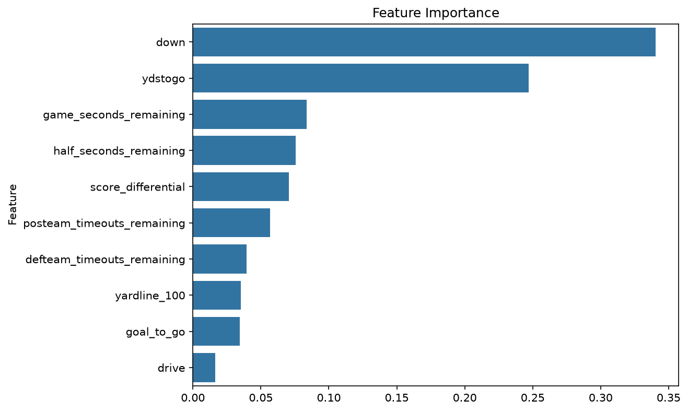
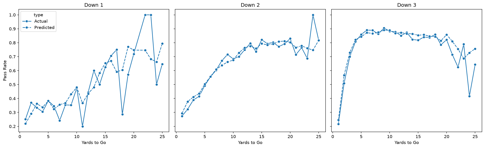

## NFL Play-Calling Predictor

Predicts whether an NFL offense will run or pass on a given play, using only information available before the snap.

Overview

Play-calling tendencies are one of the most studied questions in football analytics, and knowing whether an offense will pass or run is a major advantage for the defense. This project uses an XGBoost Classifier model trained on pre-snap data to predict play type, then validates it against real observed tendencies from a held-out season.

How it works

* Data: Play-by-play data for the 2022–2024 regular seasons (training) and 2025 regular season (testing), sourced via nflreadpy, the official Python interface to the nflverse play-by-play database.
Features: Yard line, time remaining (half and game), drive number, down, distance, goal-to-go yards, timeouts remaining for both teams, and score differential.
* Target: Binary classification: pass (1) or run (0). Special teams plays, kneels, and spikes are excluded.
* Model: XGBoost classifier (n_estimators=200, max_depth=5, learning_rate=0.1).
* Validation approach: Trained on three full past seasons (2022-2024) and then tested on an unseen future season (2025) to prevent data leakage.

Results
| Metric | Score |
|---|---|
| Accuracy | 0.70 |
| Log loss | 0.57 |

Key findings

* The down and yards to go were by far the most important features for the model, followed by seconds remaining in the game, seconds remaining in the half, and score differential. 
* The pass rate declines on 3rd down when there are more than 20 yards to go. This makes sense because teams start to elect to run the ball for better field position for a punt/field goal while burning clock when it is 3rd and long.
* The model's predicted pass probability by down and distance closely tracks actual observed pass rates (see visualization below).

Tech stack

Python, pandas, XGBoost, scikit-learn, seaborn, matplotlib, nflreadpy

Running it locally
bash
git clone https://github.com/Ian-Teigen/NFL-Play-Type-Predictor
cd nfl-play-calling-predictor
python main.py
Limitations & future work
The model doesn't account for personnel groupings, formation, or play-action tendencies, which likely explains a meaningful share of the unexplained variance.
A per-team predictability breakdown (which offenses are most/least predictable) would be a natural extension.
Hyperparameters were set manually rather than tuned via systematic search (e.g. Optuna).

Data source

Play-by-play data provided by nflverse, an open-source NFL data project.